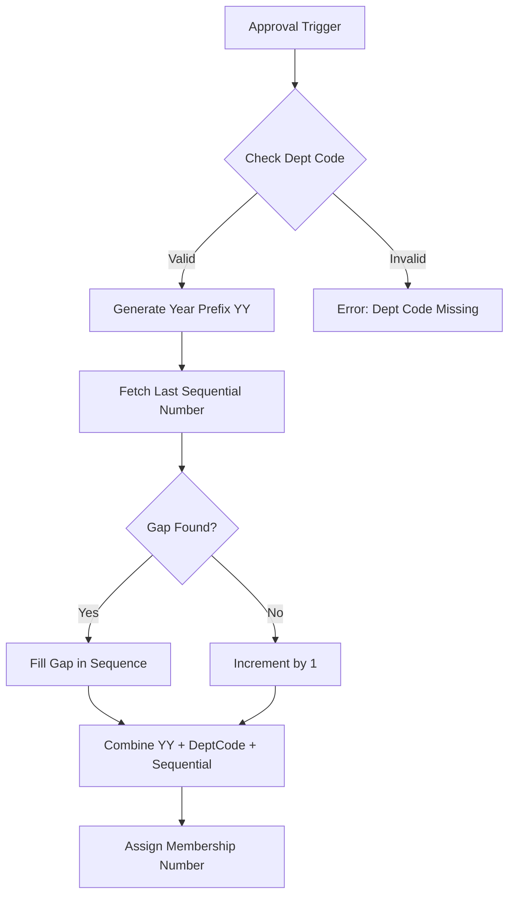
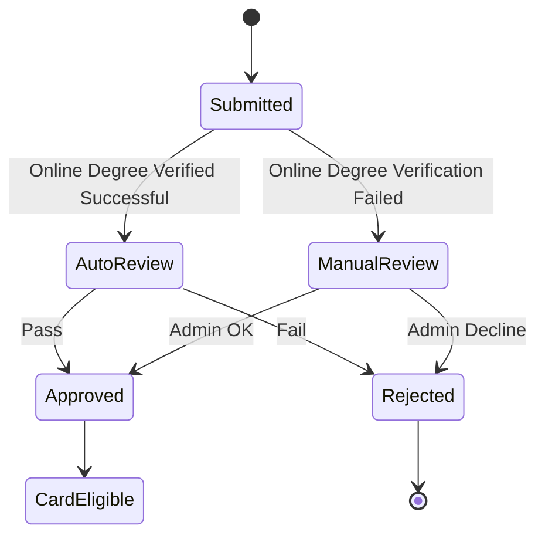
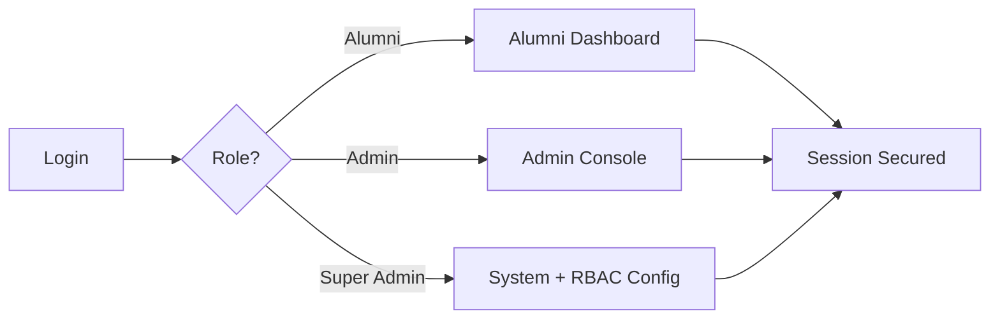

# NSUAA Membership Portal: Building a Unified Alumni Ecosystem

## Overview

The North South University Alumni Association (NSUAA) needed a modern membership portal to unify registrations, payments, and alumni engagement under one secure system. From July 2025 onward, I designed and implemented a series of major enhancements that transformed the base system into a fully customized solution tailored for NSUAA’s operational needs.

The development journey started with membership number generation and expanded into card processing, approvals, reporting, and community tools. Each enhancement was designed, developed, and implemented single-handedly to address gaps in the original system and to future-proof alumni engagement at [www.nsuaa.net](https://nsuaa.net).

---

## Alumni Registration and Verification

A structured multi-step workflow was built to ensure that only legitimate alumni could register.
- Email verification became mandatory at the first step.
- Degree completion details were cross-checked with NSU Online Degree Verification portal using unique NSU ID and Date of Birth data.
- Formal photo uploads were required, and profiles passed through admin review before card print.
- Applications moved through clear states — Pending, Approved, or Reject — creating accountability and visibility at every stage.

---

## Advanced Membership Number Generation

The first major enhancement was the **membership numbering algorithm**, which became the foundation for everything else.

- **Format**: `{YY}{DeptCode}{Sequential}` (12 digits).
- **School codes** standardized: 444 = Business, 555 = Engineering, 666 = Health Sciences, 777 = Humanities.
- **Gap-filling logic** automatically corrected skipped sequences.
- **Conflict detection** prevented duplication and maintained integrity.
- **Bulk generation** supported large alumni dataset imports.

---

## Membership Card Order Processing

Following approvals, members could request physical ID cards.

- Automated Card Order Tracking & Delivery Logging for Traceability.
- Batch aggregation of orders for shipping method and vendor tracking.
- Reprint Order statuses: Once delivered if its → Lost → Damaged → Expired → then Card Reprint Order Processing.
- Reissue process with fraud protection to prevent multiple active cards.

---

## Approval Processes

To balance automation with governance, approvals followed a hybrid workflow.

- Successful NSU online degree verified applications were auto-approved.
- Edge cases flagged for manual review.
- Dual-control for sensitive revocations.
- Random spot-check audits for accountability.
- Logs with explainable decisions and reviewer notes.

---

## Role-Based Access Control (RBAC)

The RBAC system ensured the right access for the right user.

- Alumni: events, jobs, profile management.
- Admins & Moderators: approvals, reports, card management.
- Super Admins: full system + RBAC configuration.

---

## Report Generation

Comprehensive reporting modules supported decision-making.

- Finance: reconciliation, revenue, refunds, and variances.
- Governance: membership growth, decline reasons, audit trails.
- Operations: card KPIs, courier SLAs, funnel analysis.

---

## Security and Privacy

The portal incorporated security-first design:
- Role-based access with least privilege.
- Multi-factor authentication for alumni logins.
- Encryption for sensitive data.
- Protection against SQL injection, XSS, CSRF.
- Privacy settings and retention policies for alumni.

---

## Key Outcomes

- Processing time reduced from weeks to **days**.
- Administrative workload reduced by **70%**.
- Data integrity maintained across **tens of thousands of records**.
- Alumni gained a unified hub for membership + engagement.
- Architecture ready for **multi-tenant scalability**.

---

## The Vision

The NSUAA Membership Portal is more than a registry — it is a platform for lifelong connection, community, and growth. Starting with a simple numbering algorithm, it has become a comprehensive digital transformation project that ensures alumni are not just recorded, but truly connected. Its worth mention, the project began with a Laravel-based alumni management platform originally developed by **ZainikLabs** ([www.zainiklab.com](https://www.zainiklab.com)), whose work provided the foundation.

---

*This project reflects my work as a technology consultant at Valiant Technologies® and my role as a Joint Member Secretary at NSU Alumni Association, where I designed, developed, and implemented the new features and enhancements that turned the NSUAA Membership Portal into the digital backbone for alumni engagement.*
